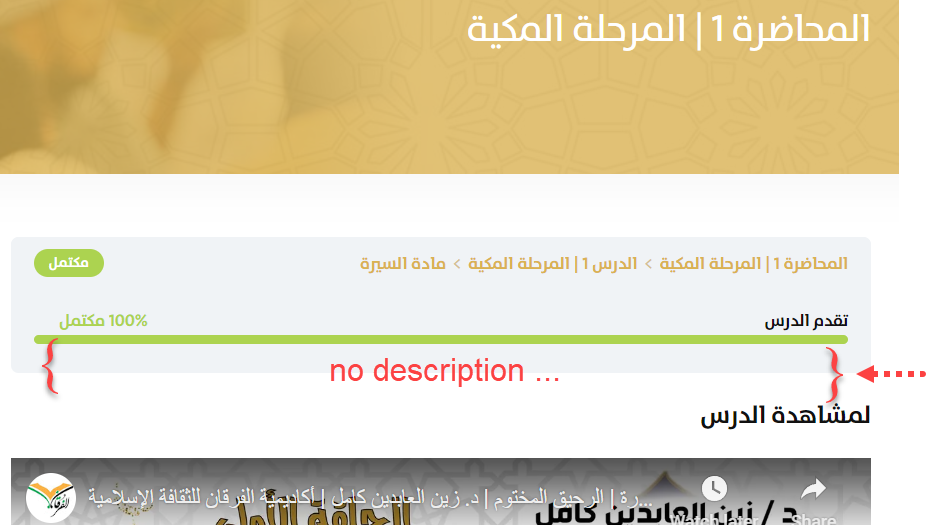
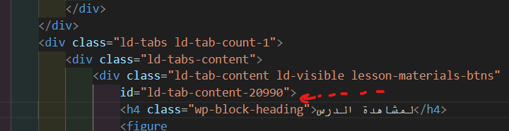
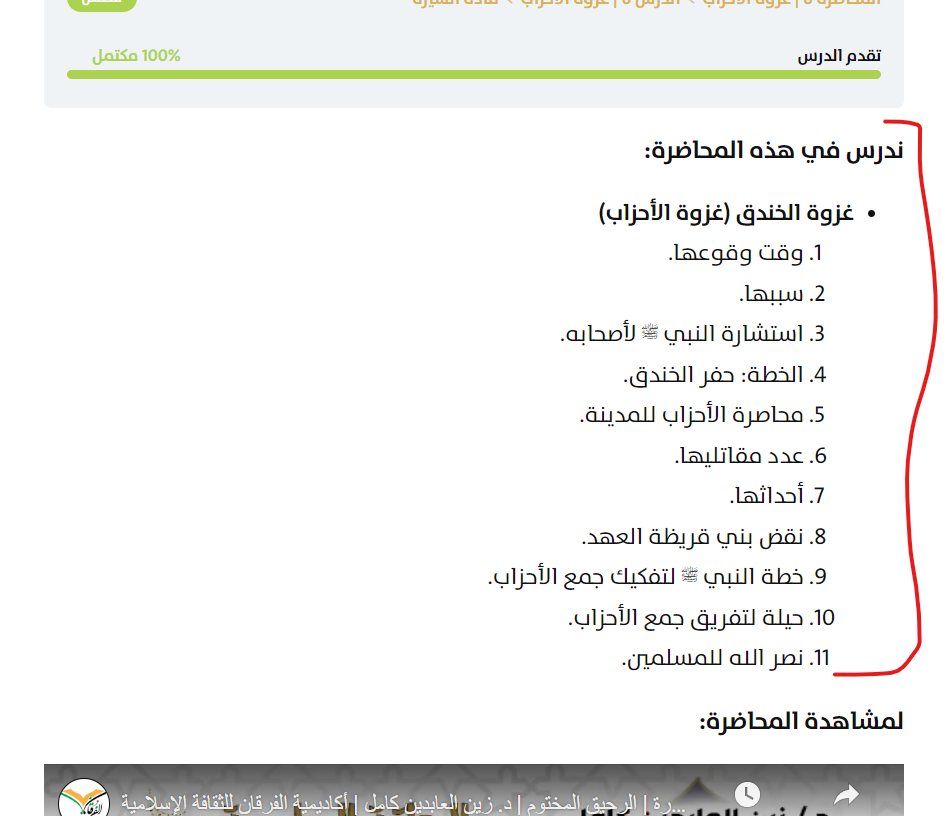

# Problem Scenario

The text formats of the descriptions describing the Forqan lessons aren't consistent, so they're harder to extract. For example, consider these different formattings:

Format 1:

So its html:

Format 2:

So its html:

](image-3.png)

There are other examples where the description is all in `
` tags, or there aren't even any `لمشاهدة ال` keywords nor descriptions. Due to this inconsistency, we decided to use beautifulsoup to extract the descriptions.

